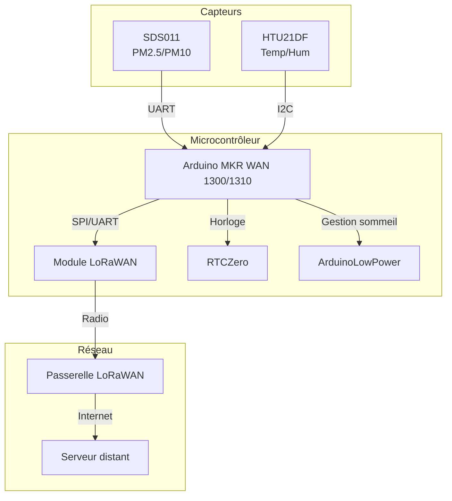
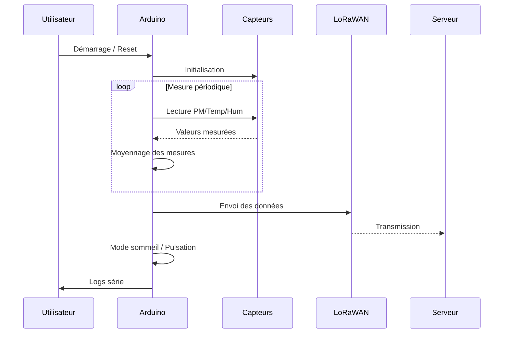

# Documentation du programme Arduino DIY_PM

## Description générale
Ce programme Arduino permet de mesurer la qualité de l’air (particules fines PM2.5/PM10, température, humidité) et d’envoyer les données via LoRaWAN. Il gère les capteurs, la communication, la basse consommation et le cycle de mesure.

## Fonctionnalités principales
- Lecture des capteurs SDS011 (PM2.5/PM10) et HTU21DF (température/humidité)
- Moyennage des mesures sur une période définie
- Envoi des données via LoRaWAN (OTAA ou ABP)
- Gestion de l’alimentation (pulsation, sommeil, reset)
- Configuration initiale via port série

## Architecture générale

## Diagramme de séquence principal

## Fichiers principaux
- `app.ino` : Code principal Arduino
- `arduino_secrets.h` : Identifiants LoRaWAN

## Variables et constantes clés
- `PULSEFREQUENCY`, `PULSEDURATION`, `MEASUREFREQUENCY`, `MEASUREDURATION` : Paramètres de mesure
- `ACTIVEPM`, `ACTIVETH`, `RESET`, `PULSE`, `FIRSTCONFIG` : Broches de contrôle

## Fonctions principales
- `setup()` : Initialisation
- `loop()` : Boucle principale
- `sendLoraMessage()` : Envoi LoRa
- `dopulse()` : Gestion du cycle de sommeil
- `firstConfiguration()` : Configuration LoRa
- `getDeviceInfos()` : Informations module
- `ledBlink()` : Indication activité

## Dépendances
- SdsDustSensor
- Adafruit_HTU21DF
- MKRWAN
- ArduinoLowPower
- RTCZero

## Remarques
- Le code est conçu pour fonctionner sur Arduino MKR WAN 1300/1310.
- La configuration initiale LoRaWAN peut être lancée via le bouton FIRSTCONFIG.
- Les identifiants LoRaWAN sont à renseigner dans `arduino_secrets.h`.
